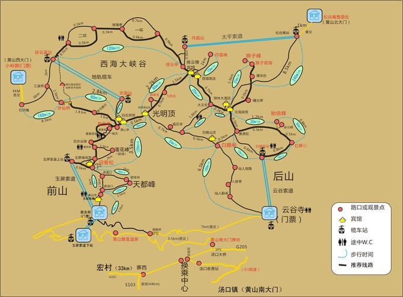
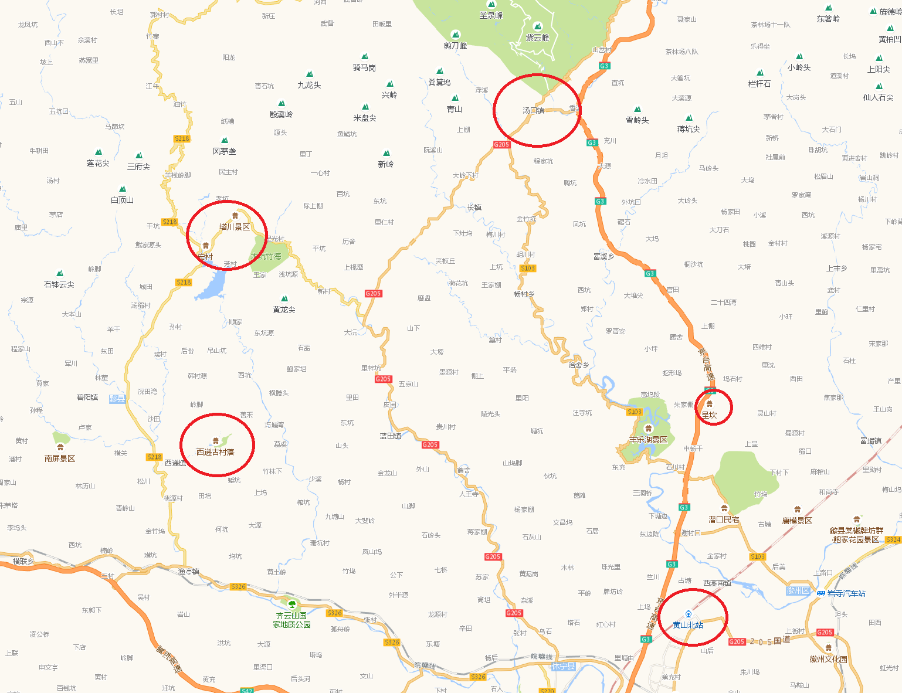
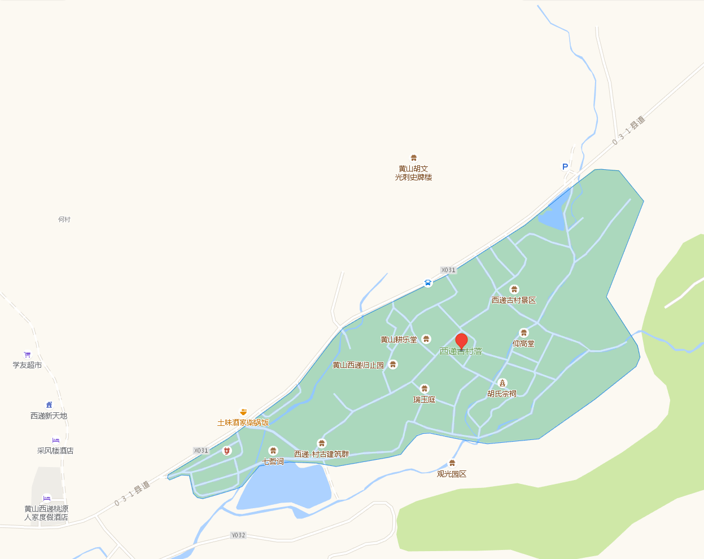

*   [概述](#overview)
*   [景點](#Attractions)
    *   [山上景點]
        
    *   [山下景點]
        *   [西遞]
        *   [宏村]
        *   [塔川]
*   [行程]
*   [住宿]
*   [裝備]
*   [花費]
    *   [機票]
    *   [住宿]
    *   [飲食]
    *   [伴手禮]
*   [參考資料]

#[概述]

#[景點]
##[山上景點]

###
###
###
###
###        
##[山下景點]

###[西遞]

####高德地圖評論
+ 建筑及村落是挺古老的，能够保存的现在实属不易。所有老宅里全部都开了店铺、饭庄给本来就空间狭小老宅增添了拥挤，给游客游览古宅带来了诸多不便同时也增添了一定的消防隐患。总之给我的感受是：人多拥挤；空间狭小。
+ 名气大，景点不多，都是住家，唯一一个好的，是古风貌保持得不错😊，但门票104(网上定90)，太坑爹，不值。文化价值4分，风景3分，服务2分，收费0分
+ 西递是一个古朴的徽派村落，相对于宏村来说，这里的文化气息更浓厚一些。建议跟随导游游览，能够了解其文化背景。夜晚没宏村繁华，更安静！
+ 古老的村落，只有景区门口的景色还可以，里面就是个旧村落。开发修建的不好！村子里都是住家户，我们不是学建筑的，根本看不出什么。门票超贵！！！太不值，都不知道拿门票钱修建什么了？！！村民在停车场就追着游客让住宿，一直追了半个村子，村落里破烂不堪，大家开玩笑说倒给钱也不住。跟宏村比相差太多，转半个小时就转完了，门票只值30！
###[宏村]
####高德地圖評論
+ 没什么太多值得游玩的，可能就两点吸引人吧，这个村大多保持着原来的样子，河水四通八达流过村子，汇集中心，古老房屋外面发霉变黑，像天然水墨山水画，还有一颗几百年的大银杏树和杨树，另一个点就是有几个历史悠久的老宅，可以了解古人的建筑风格和巧夺天工的雕刻技术。总得来说，文化遗产还需要后人好好保护，大部分都忙于做生意赚钱，到处都是生意气息，有的地破烂不堪，地方不大，环境卫生都没做好，随处可见垃圾，这里的管理工作还不如黄山，那么大的地盘，地形险峻，看起来干净，各地对景点的保护措施做得好！
+ 电影《卧虎藏龙》的取景地之一，值得一去的地方。
+ 黄山小村落，环境还好，就是商业气息太浓了，老房子里都是小吃客栈之类的。和传统的古城都一样没有老房子的味儿了！
+ 过度的商业开发，没有了以前古徽州的感觉，没有宣传片中的那么好
+ 13年学校组织写生去过宏村，不适合打卡式旅游，适合住上几天才能感受到它的魅力
+ 就这样吧，除了建筑有徽派的特色，内里基本一样，商业化带来的是同质化，早晚吧古村都磨成一个样儿！ 我去时虽然不是假期，但人是特别的多，安静的古村被弄成了闹市，只有早晨乘别人没起床，出来转转，才能感受到古村那一份从容和安定。
+ 自驾游百公里到达了大名鼎鼎的宏村，道路很窄，因为是旅游高峰期，停车场很难找。去过以后，感觉真是和想象中的相差甚远，一个村子除了建筑，完全都是商业化的，环境也是脏乱差，完全不像网上照片中那么好看~不推荐！
+ 非常不值得去，就是安徽农村半日游。门票104，**但实际上，一个村子只有一个入口嘛？你围着绕一圈照样能进去**，进去只有失望，浓重的商业性质在仿制凤凰古城的老路！跟联票里的西递没法比！全是为了骗人不生地不熟的外地人！

###塔川
+ 塔川景区的爆热得益于一群摄影爱好者，现在到皖南旅游都会安排这一景点。 带着期待来到塔川，可能是来得稍晚了些，好多红色树叶都掉了，没有了那种秋意渐浓层次分明的油墨色彩感。所以我们在镜头中寻找着秋天的美、塔川的美。 这儿几十幢粉墙黛瓦的徽派建筑依山而建，一条山溪穿村而过。村内古树参天，树大如冠。空间上的有层次性，让人的自由活动空间变大，这儿确实有别于其他到过的村庄。稻草制作的牛、马、鹅、牧童栩栩如生，舌尖上的毛豆腐鲜香美味，走在石阶铺就的乡间小道上，生活是那么的休闲惬意。
+ 花几十元车费从黄山坐两小时车，再花40元门票进村，就为了看这几个破树，实在是不值。旁边的蓝田村菊花田还漂亮
+ 村子不大，看来只有。二、三十户人家。但依山而建的古民居保存不错，掩映在浓荫丛中的粉墙黛瓦，飞檐翘角的徽派建筑群层层迭迭，错落有致。 塔川村方向一颗乌桕树近在眼前，满树的乌桕果已把我带入童年。那时我们将竹片破开裂口，夹上乌桕果，用力挤压，弹射同伴——是那个年代玩具.藏身在山谷之间的村子。树叶红、绿交错，竹林越发青翠，粉黛的民居，古朴
+ 不食人间烟火的塔川错过了黄山，宏村是万万不能错过的。下午随着酒店的专车，直奔只有半小时车程的宏村。一路与管家小哥聊侃才知，同样的古村落，东郊的塔川也是群山环绕，层峦叠嶂，尤其是深秋红叶映染下的青砖小瓦马头墙，陨落在山里的古屋，在轻雾索绕里，仙得不食人间烟火，却是饮烟缭绕，生机盎然。外来再多的嘈杂，他们照样安详地重复着他们的生活，好象外面的世界与他们无关。原来，简单，才是幸福
+ 该景区位于黟县宏村镇塔川村，离宏村二、三公里，名气远小于宏村，规模很小，几十户人家，老派房屋很少，依坡而建，错落有致，像一座塔矗立山谷中，一条小溪穿村而过，故名塔川。塔川之美在于秋，从高处俯视整个村子，缤纷多彩。我们春初去的，油菜花未开，毫无景致，走走散散心却是惬意。
###盧村
+ 网上买门票37，买了之后半小时生效，现场购买50。就一个木雕楼值得一看，而且还被破坏得差不多了，其他石雕全被***破坏了。
+ 木雕楼在卢村，算是一个比较不出名的景点，在宏村1.8公里处，走路即可到达可却有意外的惊喜，小小的古村落，为清道光年间四品朝议大夫卢帮燮所建，至今仍完整保存着志诚堂、思齐堂、思成堂等宅院，大多有点年久失修，毕竟不是热门的景点，住在木雕楼的老婆婆，还跟我们抱怨只有每天几块钱的清洁费，听起来很是心酸还是很值得一逛
+ 远观更佳。木雕楼中的部分雕刻，被毁掉了。规模有限，精美程度也不及周围的村落。胜在朴实无华，商业气氛不甚浓厚。最好在油菜花盛开的季节，或元宵节时，去感受独有的氛围。其他时间，还是去宏村，或西递吧。
###[呈坎]
+ 
+ 
+ 
##[行程]
###第一日
1. MU2050 TPE -> HFE
2. HFE -> 合肥南
3. 合肥南 -> 黃山北
4. 黃山北 -> 湯口鎮(黃山南大門)
###第二日
###第三日
###第四日
###第五日
1. HFE->TPE
##[住宿]
##[裝備]
##[花費]
###[交通]
###[住宿]
###[門票]
###[飲食]
###[伴手禮]
##[參考資料]
